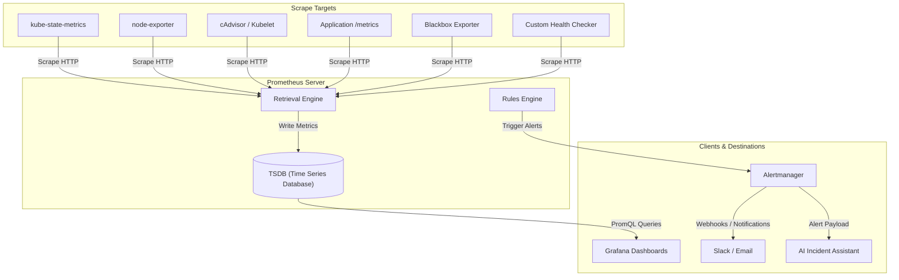

# ⚡ KubePulse: Kubernetes Cluster Health Checker & Healing

[](https://kubernetes.io)
[](https://prometheus.io)
[](#)

A production-grade, Kubernetes-native observability and health monitoring platform designed to provide real-time cluster visibility, proactive health checks, automated healing alerts, and AI-assisted incident response.


### Formal Architecture: Kubernetes Observability & Health Monitoring Platform


#### One-Line Architecture Summary


KubePulse is a Kubernetes-native observability and health management platform that connects a web dashboard to RKE2/Kubernetes, Prometheus, Grafana, Alertmanager, and notification channels to provide real-time cluster visibility, health checks, alerting, and AI-assisted incident response.


### 1. High-Level Goal


The project is a central monitoring and operations dashboard for Kubernetes-based applications.

It should allow users to:


- View real-time status of Kubernetes objects.
- Monitor application and infrastructure health.
- Collect metrics using Prometheus.
- Visualize metrics using Grafana.
- Receive alerts via email, Slack, and AI-assisted summaries.
- Track cluster events, pod failures, restarts, resource usage, and deployment health.
- Optionally take actions such as restart pod, scale deployment, or view logs.


### 2. Proposed Architecture Diagram


### 3. Core Components


#### 3.1 User Interface


The User Interface is the main dashboard where users interact with the platform.

It should show:


- Cluster overview
- Node health
- Pod status
- Deployment status
- Namespace-wise resource usage
- Application health
- Recent Kubernetes events
- Active alerts
- Historical alert timeline
- Grafana embedded dashboards
- Real-time object status

Recommended frontend stack:


- React / Next.js
- TailwindCSS
- WebSocket or Server-Sent Events for live updates
- Grafana iframe embedding or API integration

The UI should not directly talk to Kubernetes or Prometheus. It should communicate only with the backend API.


#### 3.2 Backend API Gateway


The Backend API acts as the control center of the platform.

It receives requests from the UI and routes them to the proper internal service.

Example API responsibilities:


- GET  /api/clusters
- GET  /api/namespaces
- GET  /api/pods
- GET  /api/deployments
- GET  /api/metrics/cpu
- GET  /api/metrics/memory
- GET  /api/alerts
- POST /api/actions/restart-pod
- POST /api/actions/scale-deployment

Recommended backend stack:


- Python FastAPI
- Node.js NestJS
- Go Fiber / Gin

Since you are already familiar with Python, FastAPI would be a strong choice.


#### 3.3 Authentication and RBAC Layer


This layer controls who can access what.

Example user roles:


| Role | Permissions |
| --- | --- |
| Admin | Full access, cluster actions, alert configuration |
| DevOps | View cluster, restart workloads, manage alerts |
| Developer | View application namespace and logs |
| Viewer | Read-only access |

Authentication options:


- LDAP
- OAuth2 / OIDC
- Google Login
- GitHub Login
- Keycloak

Since you previously worked with LDAP authentication, this platform can support LDAP login.

Flow:


### 4. Kubernetes / RKE2 Layer


#### 4.1 RKE2 Kubernetes Cluster


RKE2 is the Kubernetes distribution running your workloads.

This layer contains:


- Control Plane
- Worker Nodes
- Pods
- Deployments
- Services
- Ingress
- ConfigMaps
- Secrets
- Namespaces
- Persistent Volumes

The platform should communicate with Kubernetes using the Kubernetes API.

The backend service should run inside the cluster and use a Kubernetes ServiceAccount with limited RBAC permissions.

Example:

```text
Dashboard Backend Pod
        |
        | in-cluster ServiceAccount
        v
Kubernetes API Server
```

#### 4.2 Kubernetes Integration Service


This service reads Kubernetes objects and sends the data to the UI.

It should collect:


- Nodes
- Namespaces
- Pods
- Deployments
- ReplicaSets
- StatefulSets
- DaemonSets
- Services
- Ingresses
- Events
- ConfigMaps
- Secrets metadata only
- PersistentVolumes
- PersistentVolumeClaims

Example object status:

```json
{
  "namespace": "production",
  "deployment": "payment-service",
  "desiredReplicas": 3,
  "availableReplicas": 2,
  "status": "Degraded",
  "reason": "One pod is in CrashLoopBackOff"
}
```
This service should also support controlled actions:


- Restart pod
- Scale deployment
- Rollout restart deployment
- View pod logs
- View events
- Describe object

Actions must be protected by RBAC and audit logging.


### 5. Health Checker Service


The Health Checker is one of the most important custom components.

Its job is to continuously check whether the cluster and applications are healthy.


#### 5.1 What It Checks


Kubernetes Health


- Node Ready / NotReady
- Pod Running / Pending / Failed
- CrashLoopBackOff
- ImagePullBackOff
- Deployment replica mismatch
- High restart count
- PVC pending
- Ingress unavailable
- Service endpoint missing

Application Health


- HTTP health endpoint
- Readiness endpoint
- Liveness endpoint
- Response time
- Error rate
- Dependency status
- Database connection status

Example:

GET http://payment-service.production.svc.cluster.local/health

Response:

```json
{
  "status": "UP",
  "database": "UP",
  "redis": "UP",
  "version": "1.4.2"
}
```
Version Check

Your sketch mentions “version” near Prometheus and Grafana. This can be formalized as a Version Inventory Module.

It can track:


- Application version
- Docker image tag
- Helm chart version
- Kubernetes version
- RKE2 version
- Prometheus version
- Grafana version
- Node OS version

This is useful for release tracking and debugging.


### 6. Prometheus Metrics Layer


Prometheus will collect and store time-series metrics.


#### 6.1 Prometheus Scraping Targets


Prometheus should scrape:


| Source | Purpose |
| --- | --- |
| kube-state-metrics | Kubernetes object state |
| node-exporter | Node CPU, memory, disk, network |
| cAdvisor / kubelet | Container-level metrics |
| Application /metrics endpoints | Business and app metrics |
| Blackbox exporter | External endpoint checks |
| Custom health checker | Custom health metrics |

Example application metrics:


- http_requests_total
- http_request_duration_seconds
- app_errors_total
- database_connection_status
- queue_pending_jobs


#### 6.2 Prometheus Data Flow




### 7. Grafana Visualization Layer


Grafana should be used for advanced metric visualization.

Dashboards can include:


- Cluster Overview
- Node Resource Usage
- Namespace Resource Usage
- Pod CPU / Memory
- Deployment Health
- Application Latency
- Application Error Rate
- Ingress Traffic
- Database Metrics
- Alert History
- SLO / SLA Dashboard

Grafana can be connected to:


- Prometheus
- Loki, if logs are added
- Tempo, if distributed tracing is added
- PostgreSQL, for custom platform data

The main UI can either:


- Embed Grafana dashboards using iframe.
- Use Grafana API.
- Show summarized metrics directly from Prometheus.

Recommended approach:


- Use your own UI for high-level status.
- Use Grafana for deep metric analysis.


### 8. Alerting Architecture


Alerts should be handled by Prometheus Alertmanager and your custom Alert Service.


#### 8.1 Alert Flow


#### 8.2 Example Alert Rules


Pod CrashLoopBackOff

```yaml
alert: PodCrashLooping
expr: increase(kube_pod_container_status_restarts_total[5m]) > 3
for: 2m
labels:
  severity: critical
annotations:
  summary: "Pod is restarting frequently"
  description: "Pod {{ $labels.pod }} in namespace {{ $labels.namespace }} restarted more than 3 times in 5 minutes."
```
Node Not Ready

```yaml
alert: NodeNotReady
expr: kube_node_status_condition{condition="Ready",status="true"} == 0
for: 5m
labels:
  severity: critical
annotations:
  summary: "Kubernetes node is not ready"
```
High CPU Usage

```yaml
alert: HighCPUUsage
expr: avg(rate(container_cpu_usage_seconds_total[5m])) by (pod) > 0.8
for: 5m
labels:
  severity: warning
annotations:
  summary: "High CPU usage detected"
```

### 9. AI-Based Incident Assistant


Your sketch mentions something like “Slack AI”. This can be expanded into an AI Incident Explanation Service.

Instead of sending raw alerts only, the system can generate helpful summaries.

Example raw alert:

Pod payment-service-7d9f4 is in CrashLoopBackOff.

AI-enhanced alert:


- Incident: payment-service is repeatedly crashing in production.
- Likely causes:
1. Recent deployment may have introduced a runtime error.
2. Environment variable or secret may be missing.
3. Database connection may be failing.
- Recommended actions:
1. Check pod logs.
2. Compare current image version with previous release.
3. Verify ConfigMap and Secret values.
4. Run kubectl describe pod payment-service-7d9f4.

The AI service should receive:


- Alert payload
- Kubernetes events
- Pod logs
- Deployment version
- Recent rollout history
- Prometheus metrics

It should return:


- Incident summary
- Root-cause hints
- Suggested remediation steps
- Severity explanation


### 10. Real-Time Dashboard


The dashboard should show live Kubernetes and application status.


#### 10.1 Real-Time Data Sources


- Kubernetes Watch API
- Prometheus query API
- Health checker results
- Alertmanager webhook events
- Application health endpoints


#### 10.2 Communication Method


Use either:


- WebSocket
- Server-Sent Events
- Polling fallback

Recommended:


- WebSocket for live dashboard updates.
- Polling fallback every 30 seconds if WebSocket fails.

Example flow:


### 11. Data Storage Design


The system should use multiple storage layers.


#### 11.1 PostgreSQL


Used for platform metadata.

Stores:


- Users
- Roles
- Teams
- Cluster registration
- Alert configuration
- Notification channels
- Audit logs
- Dashboard preferences
- Incident history
- Application metadata

Example tables:


- users
- roles
- user_roles
- clusters
- namespaces
- applications
- alert_rules
- notification_channels
- incidents
- audit_logs


#### 11.2 Redis


Used for fast temporary data.

Stores:


- Session cache
- Real-time status cache
- Recent health check results
- Rate limiting counters
- Temporary alert deduplication keys


#### 11.3 Prometheus TSDB


Used for time-series metrics.

Stores:


- CPU usage
- Memory usage
- Pod restart count
- HTTP latency
- Request rate
- Error rate
- Node metrics
- Application metrics


#### 11.4 Optional: Loki


Add Loki if you want centralized logs.


- Pod logs
- Application logs
- System logs
- Ingress logs


#### 11.5 Optional: Tempo / Jaeger


Add distributed tracing for microservices.


- Request traces
- Service-to-service latency
- Dependency chain analysis


### 12. Connectivity Between Components


#### 12.1 UI to Backend


```text
Browser UI
   |
   | HTTPS REST API / WebSocket
   v
Backend API
```
The UI should not directly access Kubernetes, Prometheus, or Grafana using admin credentials.


#### 12.2 Backend to Kubernetes


```text
Backend API
   |
   | Kubernetes Python/Go client
   v
Kubernetes API Server
```
Use in-cluster authentication:


- ServiceAccount
- ClusterRole
- ClusterRoleBinding

Permissions should be limited.

Example read-only permissions:


- resources:
- pods
- services
- deployments
- nodes
- events
- verbs:
- get
- list
- watch

For admin actions, create a separate role.


#### 12.3 Prometheus to Kubernetes


```text
Prometheus
   |
   | Scrapes metrics
   v
kube-state-metrics / node-exporter / app metrics
```
Prometheus does not control Kubernetes. It only collects metrics.


#### 12.4 Alertmanager to Notification Channels


```text
Alertmanager
   |
   | Webhook
   v
Alert Service
   |
   | Email / Slack / AI
   v
Users
```
The custom Alert Service gives you more flexibility than sending directly from Alertmanager.


#### 12.5 Grafana to Prometheus


```text
Grafana
   |
   | PromQL queries
   v
Prometheus
```
Grafana is mainly for visualization and dashboards.


### 13. Recommended Microservices


You can divide the backend into these services.


| Service | Responsibility |
| --- | --- |
| API Gateway | Main entry point for UI |
| Auth Service | Login, JWT, LDAP/OIDC integration |
| Kubernetes Service | Reads Kubernetes objects and events |
| Metrics Service | Queries Prometheus |
| Health Checker Service | Checks app and cluster health |
| Alert Service | Receives alerts and sends notifications |
| AI Incident Service | Generates alert explanations |
| Dashboard Service | Sends real-time updates to UI |
| Audit Service | Stores user actions and system events |

For the first version, you do not need all as separate services. You can start with a modular monolith and split later.

Recommended MVP backend structure:


- backend/
- app/
- main.py
- auth/
- kubernetes/
- metrics/
- health/
- alerts/
- dashboard/
- notifications/
- ai/
- database/


### 14. Deployment Architecture


The entire platform should run inside Kubernetes.


Recommended deployment tools:


- Helm charts
- Argo CD for GitOps
- Docker images
- Kubernetes manifests


### 15. Security Architecture


Security is very important because this platform can access Kubernetes internals.


#### 15.1 Authentication


Use:


- LDAP / OIDC / OAuth2
- JWT access token
- Refresh token
- Session expiration


#### 15.2 Authorization


Use two levels of RBAC:


- Application-level RBAC
- Kubernetes-level RBAC

Example:

```text
User has Developer role
        |
        v
Can view only namespace: dev
        |
        v
Backend uses restricted Kubernetes permissions
```

#### 15.3 Secrets Management


Use:


- Kubernetes Secrets
- External Secrets Operator
- HashiCorp Vault, optional
- Sealed Secrets, optional

Never store secrets in code or Git.


#### 15.4 Audit Logging


Every sensitive action should be logged.

Examples:


- User restarted pod
- User scaled deployment
- User changed alert rule
- User added Slack webhook
- User viewed production logs

Audit log fields:


- user_id
- action
- resource_type
- resource_name
- namespace
- cluster
- timestamp
- ip_address
- result


### 16. Suggested MVP Scope


For the first working version, build only the core platform.

MVP Features


- Login
- Cluster overview dashboard
- Namespace list
- Pod list
- Deployment list
- Node health
- Pod status
- Basic health checker
- Prometheus integration
- Grafana dashboard link/embed
- Slack/email alerting
- Real-time dashboard updates
- Audit logs

Do not start with full AI automation, multi-cluster, tracing, and advanced remediation. Add them later.


### 17. MVP Architecture


### 18. Development Roadmap


Phase 1: Foundation

Build the base project.

Deliverables:


- Frontend skeleton
- Backend API skeleton
- Docker setup
- Kubernetes deployment manifests
- PostgreSQL integration
- Redis integration
- Authentication setup
- Basic UI layout

Phase 2: Kubernetes Integration

Add Kubernetes object visibility.

Deliverables:


- Connect backend to Kubernetes API
- Show nodes
- Show namespaces
- Show pods
- Show deployments
- Show pod status
- Show Kubernetes events
- Add namespace filtering
- Add cluster summary cards

Example dashboard cards:


- Total Nodes: 5
- Healthy Nodes: 4
- Running Pods: 132
- Failed Pods: 3
- Active Alerts: 7
- CPU Usage: 64%
- Memory Usage: 71%

Phase 3: Prometheus and Grafana

Add monitoring.

Deliverables:


- Install Prometheus
- Install kube-state-metrics
- Install node-exporter
- Install Grafana
- Create base dashboards
- Expose Prometheus query API through backend
- Show CPU/memory charts in UI

Phase 4: Health Checker

Add custom health checking.

Deliverables:


- Create Health Checker service
- Check application endpoints
- Check pod restart count
- Check deployment availability
- Check service endpoint availability
- Store health result in Redis/PostgreSQL
- Show health status in dashboard

Health result model:

```json
{
  "service": "payment-service",
  "namespace": "production",
  "status": "degraded",
  "reason": "2 of 3 replicas available",
  "lastCheckedAt": "2026-05-31T10:30:00Z"
}
```
Phase 5: Alerting

Add alert rules and notifications.

Deliverables:


- Configure Alertmanager
- Create Prometheus alert rules
- Build Alert Service webhook
- Add Slack notification
- Add email notification
- Show active alerts in UI
- Store alert history

Phase 6: Real-Time Dashboard

Add live updates.

Deliverables:


- WebSocket backend
- Kubernetes watch integration
- Live pod status updates
- Live alert updates
- Live health status updates
- Frontend real-time refresh

Phase 7: AI Incident Assistant

Add intelligent alert explanation.

Deliverables:


- Send alert data to AI service
- Include logs/events/metrics context
- Generate incident summary
- Generate likely cause
- Generate suggested fix
- Send enriched message to Slack/email
- Show AI summary in dashboard

Phase 8: Production Hardening

Prepare for real usage.

Deliverables:


- TLS everywhere
- RBAC hardening
- Network policies
- Rate limiting
- Audit logging
- Backup strategy
- High availability setup
- Resource requests/limits
- Helm chart
- Argo CD deployment
- Monitoring for the monitoring system itself


### 19. Final Recommended Tech Stack


| Layer | Recommended Tool |
| --- | --- |
| Kubernetes | RKE2 |
| Frontend | React / Next.js |
| Backend | FastAPI |
| Auth | LDAP + JWT, later OIDC |
| Database | PostgreSQL |
| Cache | Redis |
| Metrics | Prometheus |
| Visualization | Grafana |
| Alerts | Alertmanager |
| Notifications | Slack, Email |
| Logs | Loki, optional |
| Tracing | Tempo or Jaeger, optional |
| Deployment | Helm |
| GitOps | Argo CD |
| AI Layer | LLM-based incident summarizer |


### 20. Suggested Final System Name


You can name the project something like:

KubePulse

or

RKE2 Sentinel

or

ClusterWatch

My recommendation: KubePulse.

It sounds like a system that continuously checks the “pulse” of your Kubernetes cluster and applications.

